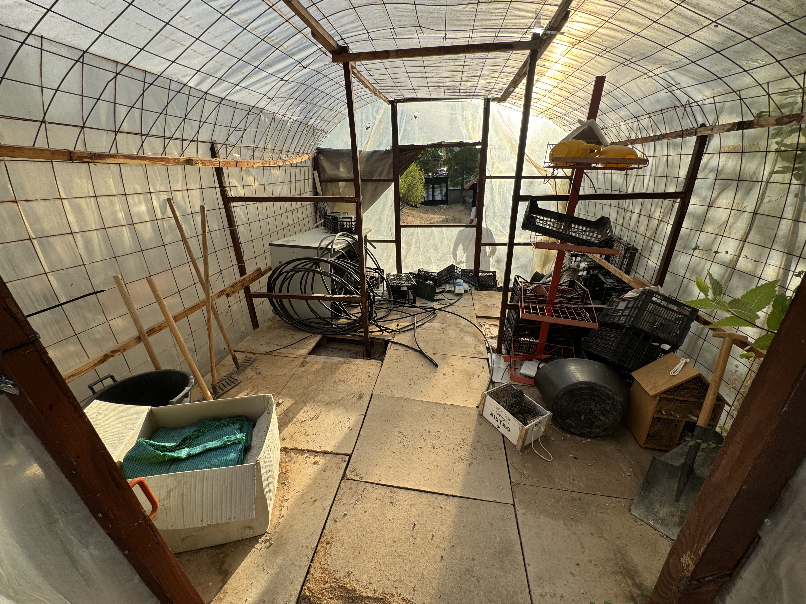
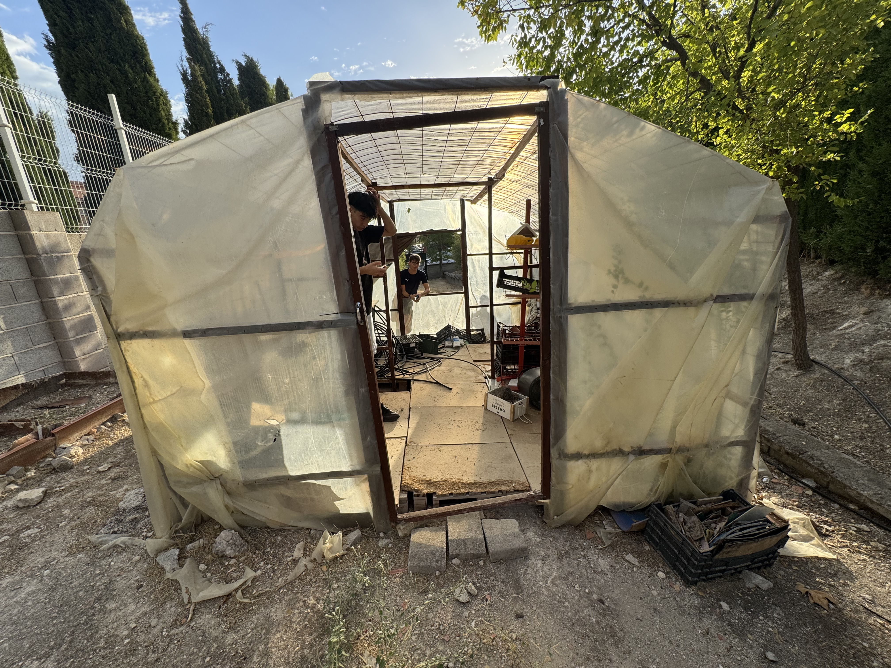

# Cuaderno de tecnología 2025/26
Cuaderno de tecnología 2025/26 de 4ºESO

# 1º Proyecto: Mapa de Jaén.

## Diseño del mapa de Jaén a mano.
 
 

Este es el diseño que está hecho a mano alzado sobre de cómo colocar el mapa inclinado sobre la mesa. Mi propuesta es que si sabemos que las mesas utilizables son de 0,8 m de ancho y de largo 1,6 m, y el mapa es de 1,52 m de largo y 1,12 m de ancho. De largo sí cabe el mapa pero, de ancho se sobrepasa, por eso tendremos que juntar dos mesas para que el ancho no se pase. Y para inclinar el mapa yo pienso usar placas de madera y lo juntamos con tornillo, y el ancho de la tabla es mayor que el de mapa, después usaremos palos metálicos o algo que puede aguantar el peso que tiene, y al final poner algo transparente que se pueda observar el mapa por arriba, por ejemplo como una cristalera o un metacrilato.

CORREGIDO POR IA.
 
## Foto del mapa.

 

 

## Diseño 3D del mapa.

 

 

 

## Presupuesto del mapa.

- Tabla de madera: gratis (porque en el taller hay bastantes).

- Metacrilato: 121.75 € (aproximadamente).

- Palos metálicos o de madera: gratis (en el taller hay).

- Tornillos: gratis (en el taller hay).

# 2º Proyecto: Invernadero.

## Invernadero por dentro.
  
 

Recomendaciones: mi recomendación es cambiar el suelo de madera porque el de antes esta viejo y roto, quitar las cosas que no sirven y ponerle estantes para poner macetas y cosas.

## Invernadero por el lado derecho.

 

Recomendaciones: mi recomendación es cortar los filos metalicos que estan sobresalidos porque sino es facil de dañar a alguien y cambiar un tejado de plastico más limpio y nuevo.

## Invernadero por el lado frontal.

 

Recomendaciones: mi recomendación es cambiarle la puerta porque esta muy rota.
 
## Invernadero por el lado izquierdo.

 

Recomendaciones: aqui no tengo mucho por decir que también es cambiarle otro tejado nuevo.

## Invernadero por la parte trasera.

 

Recomendaciones: mi recomendación es ponerle una ventana y cambiarle el palo metálico que esta sujetado el la foto.

## Diseño 3D de invernadero.

 

 

 

## Presupuesto del invernadero.

- puerta de madera: 50-80 € (aproximadamente).

- madera de suelo: 10-17 € (aproximadamente).

- escantes: 20-30 € (aproximadamente).

- ventana demadera: 70-109 € (aproximadamente).

- tejado transparente: 15-25 € (aproximadamente).
