Estos son programaciones en el torneo que participaremos de tecnologia.

# Porgramación de PIR

# Foto de montaje con sensor de presión.

| Foto 1 | Foto 2 | Foto 3 |
| - | - | - |
| 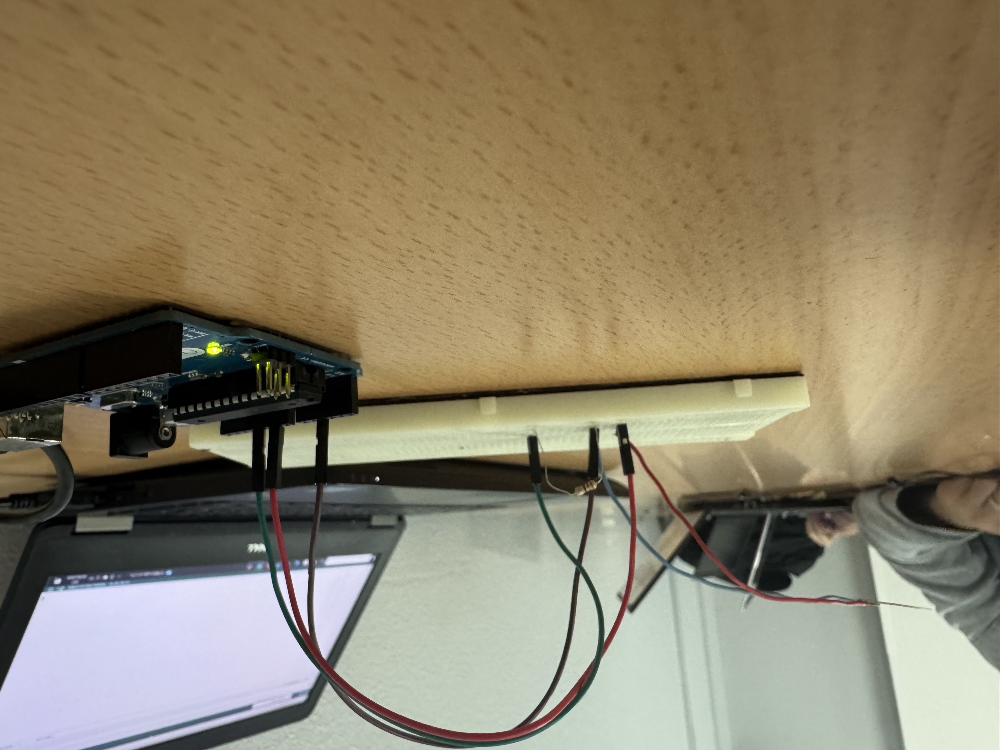 | 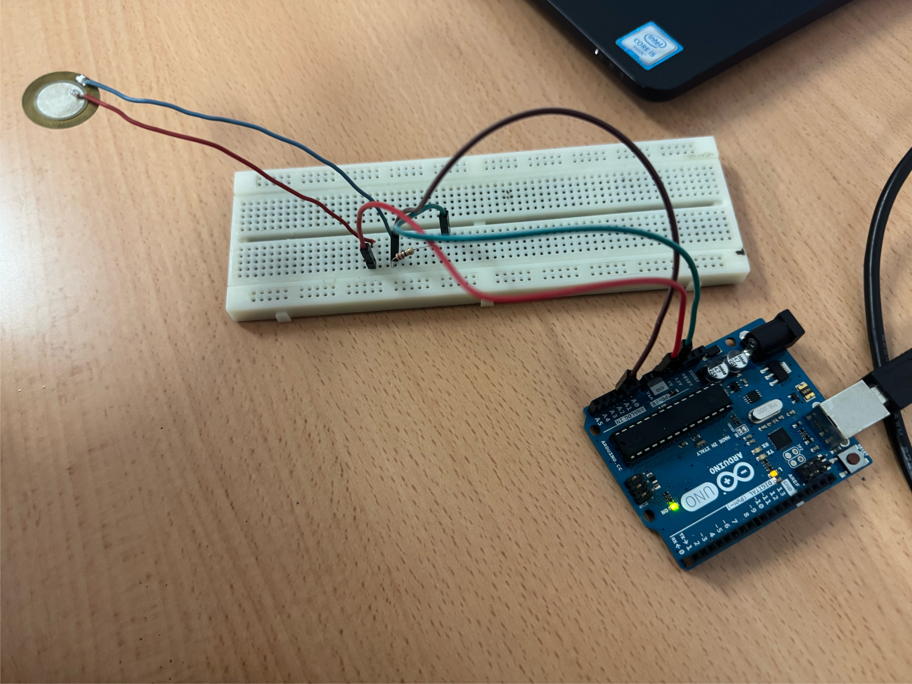 | 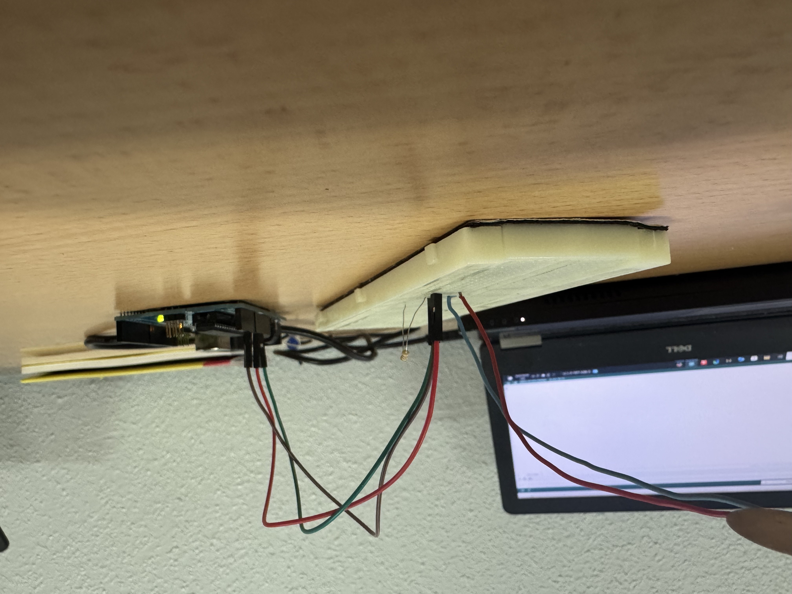 |

El objetivo de este circuito es que tenemos un sensor de presión,, cuando no le hacemmos nada tiene un valor y cuando le pulsamor el valor cami depende dde la fuenta que le metemos al sensor.

# Programación con sensor de presión.

Este programa emmpieza con tres int (variables), uno es sensorPIN esta conectado al A2, otro que dice que ell valorsensor es 0 y otro que es solamente presión.

Después tenemos un void stup(inicio de programa en que solo fuciona una vez), dentro de el solo tenemos un Serial.begin(9600) (es la velocidad que traspasa que son 9600 baudios).

Después tenemos un void loop(crear un bucle), dentro tenemos valorsensor = analogRead(sensorPIN) ( significca quue los valores de valorsensor es igual que la lectura analógica del sensorPIN), tenemos que presion = map(valorsensor, 0, 1023, 0, 100) (significa que la prresion es igual quue el mapeo del valorSensor, que es de 0 a 1023 y el 0 y 100 es los valores que ns marquen en el ordenador), después tenemos Serial.print("Valor de presión: ") (significa que en el monitor serie marcará como nombre de vallor de presión), después tenemos Serial.println(presion) (significa que el monitor serie coge valores de la presion) y al final tenemos un delay(500) (para que tenga un tiimpo dde pausa):

# Video de funcionamiento con sensor de presión.

  

# Foto de montaje con sensor de humedad.

| Foto 1 | Foto 2 | Foto 3 |
| - | - | - |
| 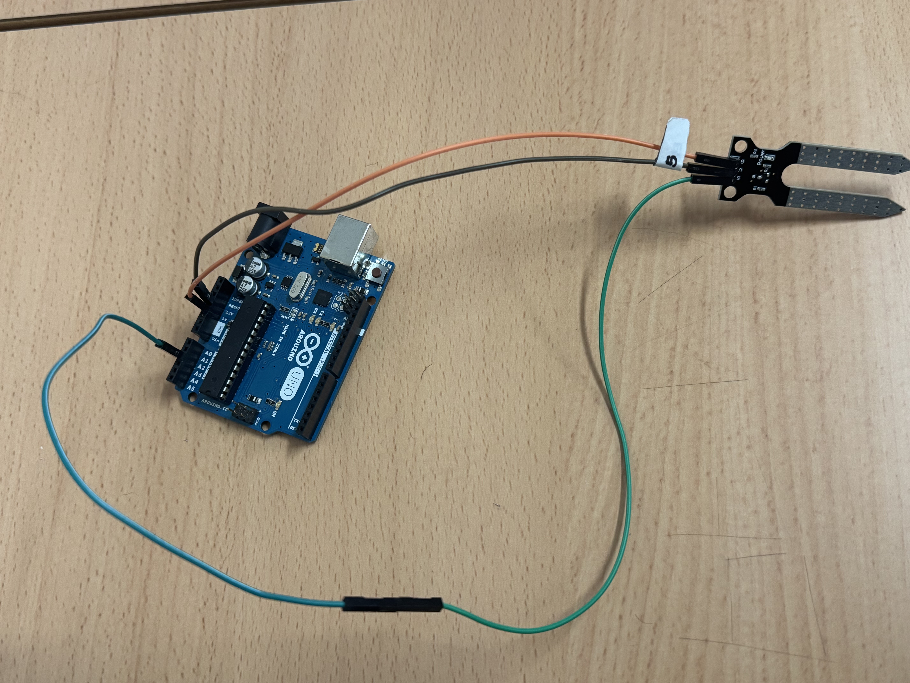 | 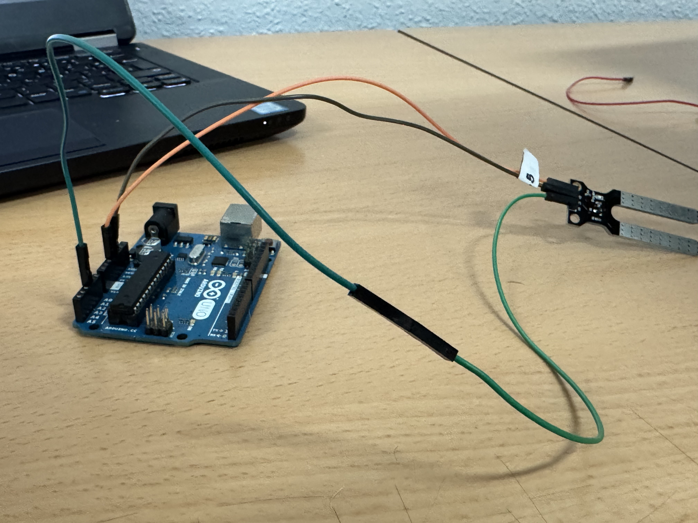 |  |

El objetivo de este circuito es que al cambiar de humedad de algo, el valr o sube o baja.

# Programación con sensor de humedad.

# Video de funcionamiento con sensor de humedad.

# Foto de montaje con sensor de LDR.

| Foto 1 | Foto 2 | Foto 3 |
| - | - | - |
| 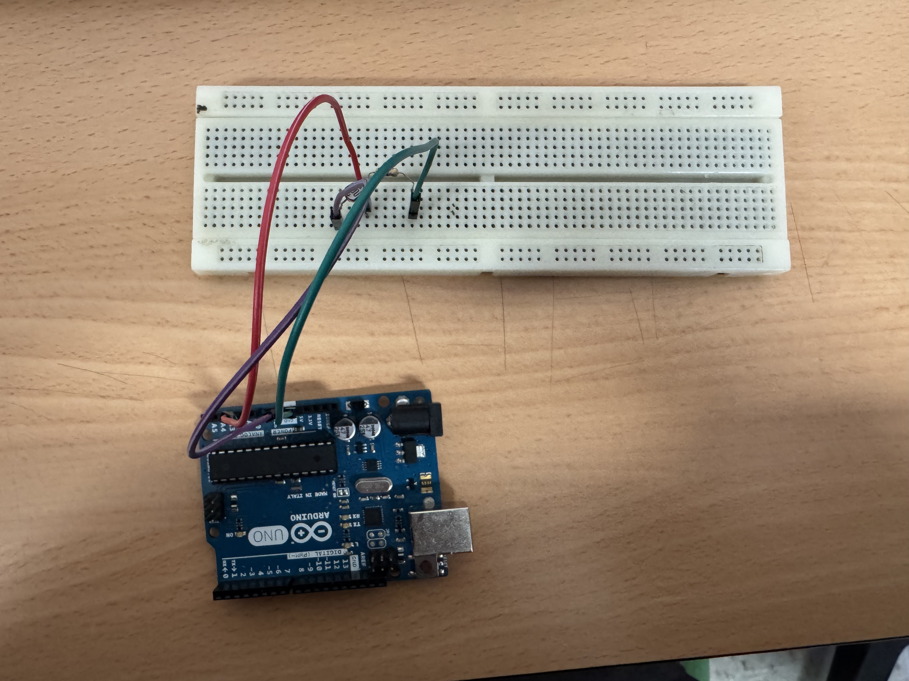 | 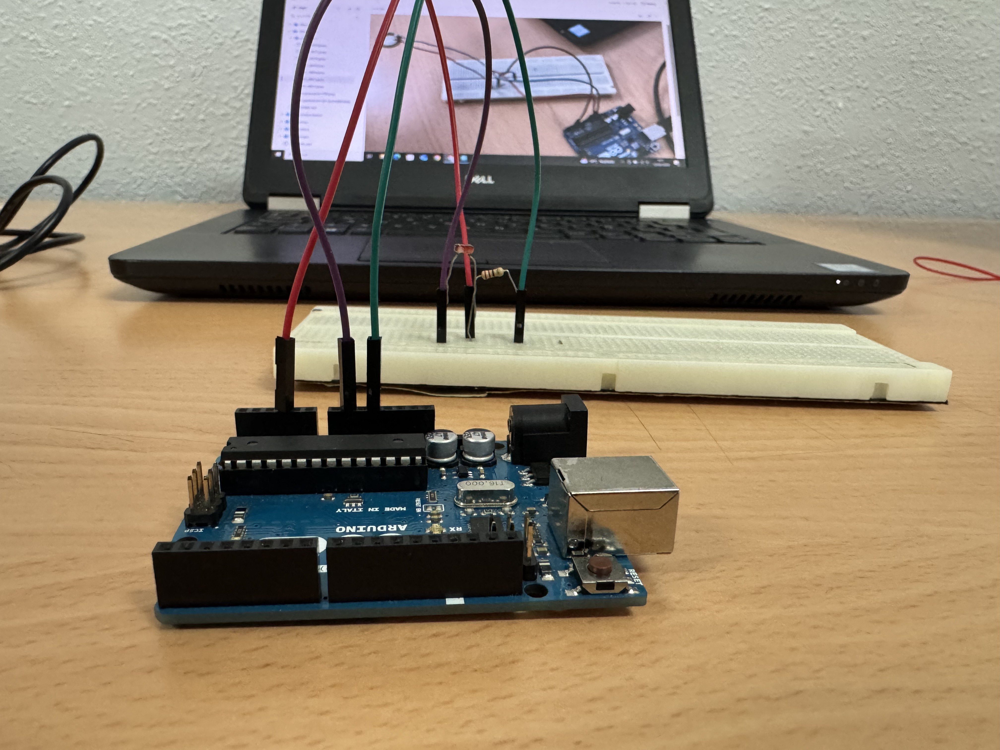 | 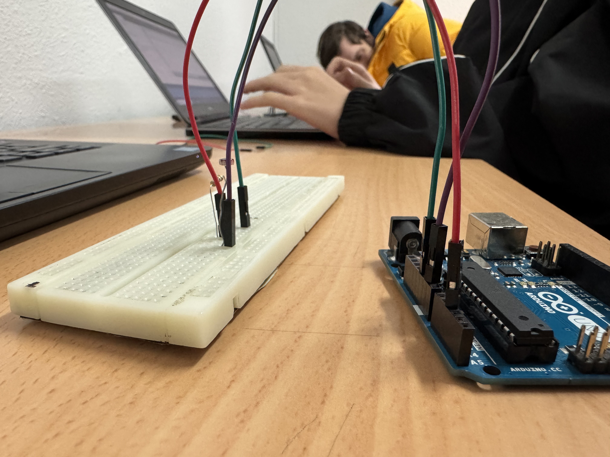 |

El objetivo de este circuito es que al cambiar la cantidad de luz la que detecta el valoe sube o baja.

# Programación con sensor de LDR.

# Video de funcionamiento con sensor de LDR.

# Foto de montaje con sensor de temperatura.

| Foto 1 | Foto 2 | Foto 3 |
| - | - | - |
|  | 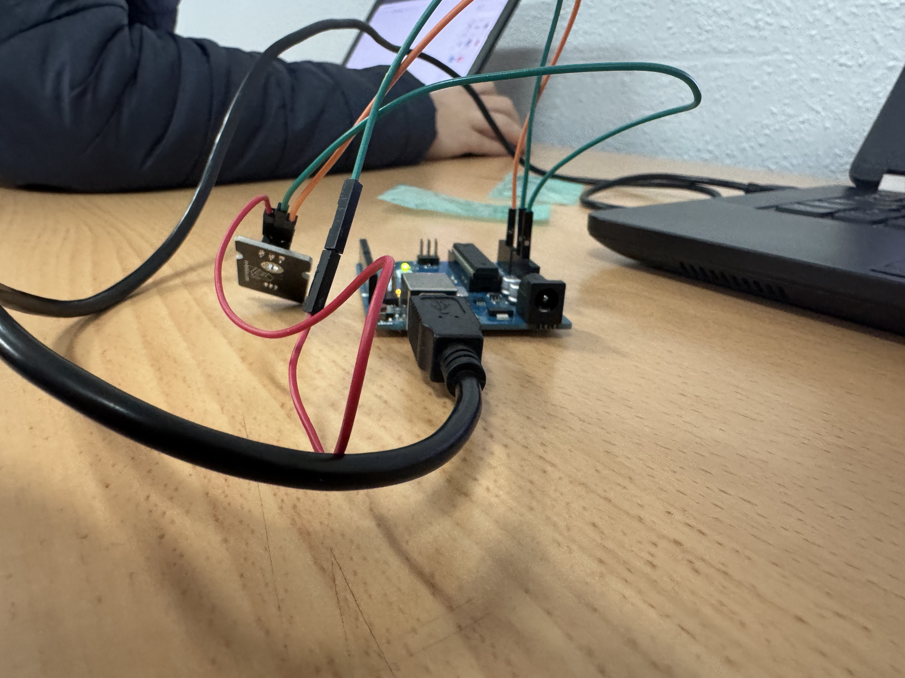 |  |

# Programación con sensor de temperatura.

# Video de funcionamiento con sensor de temperatura.

# Foto de montaje con sensor de presión lineal.

 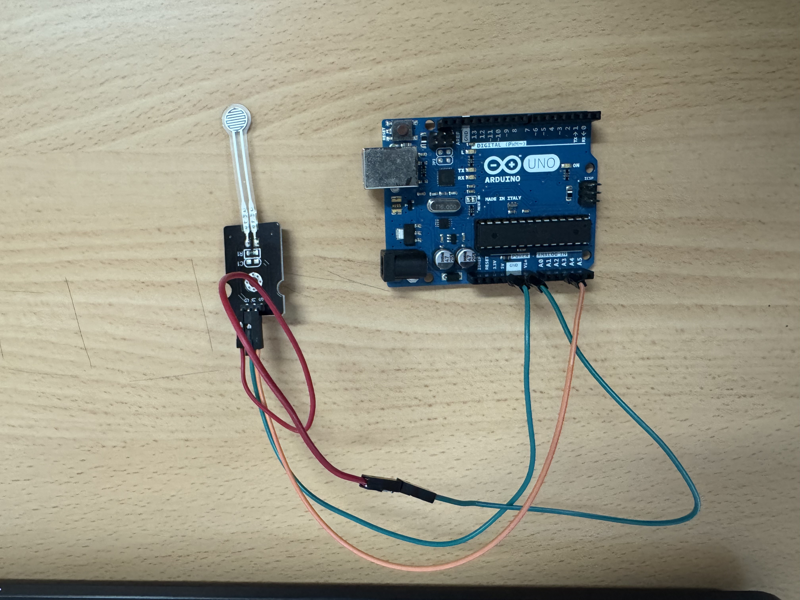

 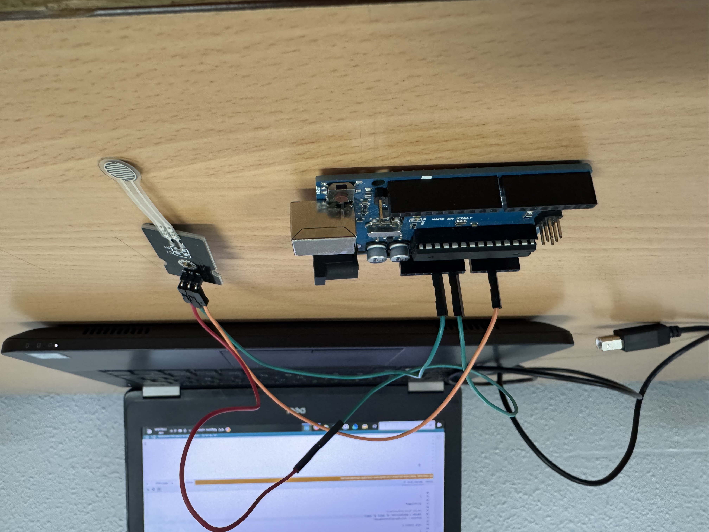

 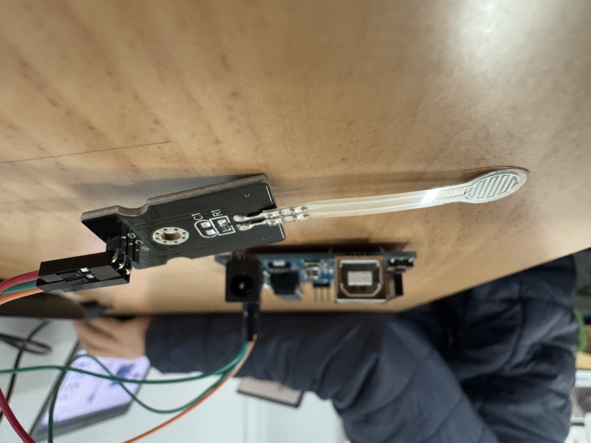

# Programación con sensor de presión lineal.

 

# Video de funcionamiento con sensor de presión lineal.

 
