Estos son programaciones en el torneo que participaremos de tecnologia.

# Sensor de PIR.

## - Programación con sensor de PIR.

Este es el programación del PIR y esta explicado todos dentro de la programación.

## - Foto de montaje con sensor de PIR.

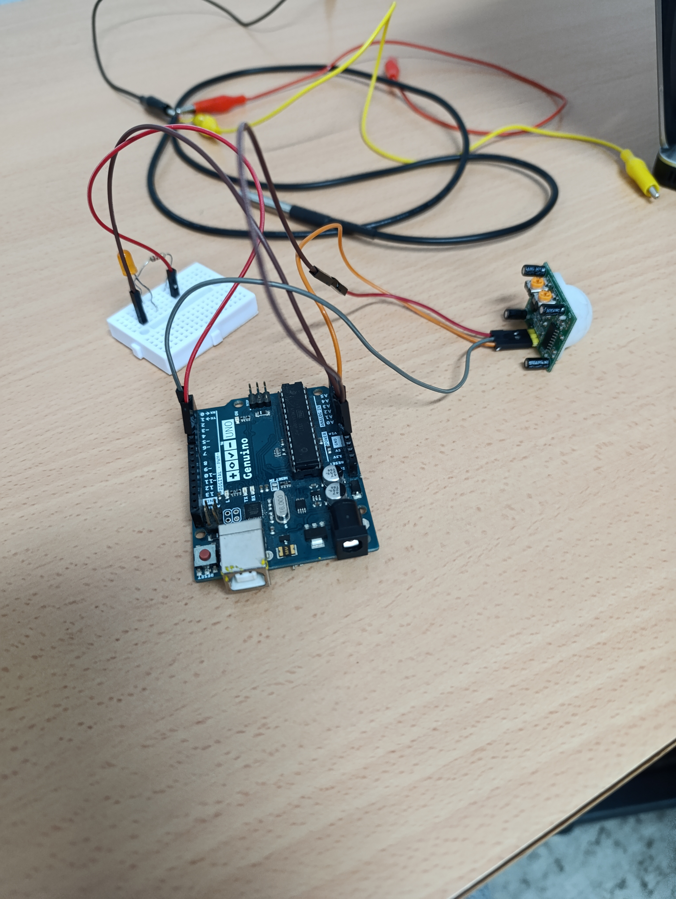

El objetivo de este circuito es que detecta personas, si detecta manda una señal y si no manda otra señal.

# Sensor de presión.

## - Foto de montaje con sensor de presión.

| Foto 1 | Foto 2 | Foto 3 |
| - | - | - |
| 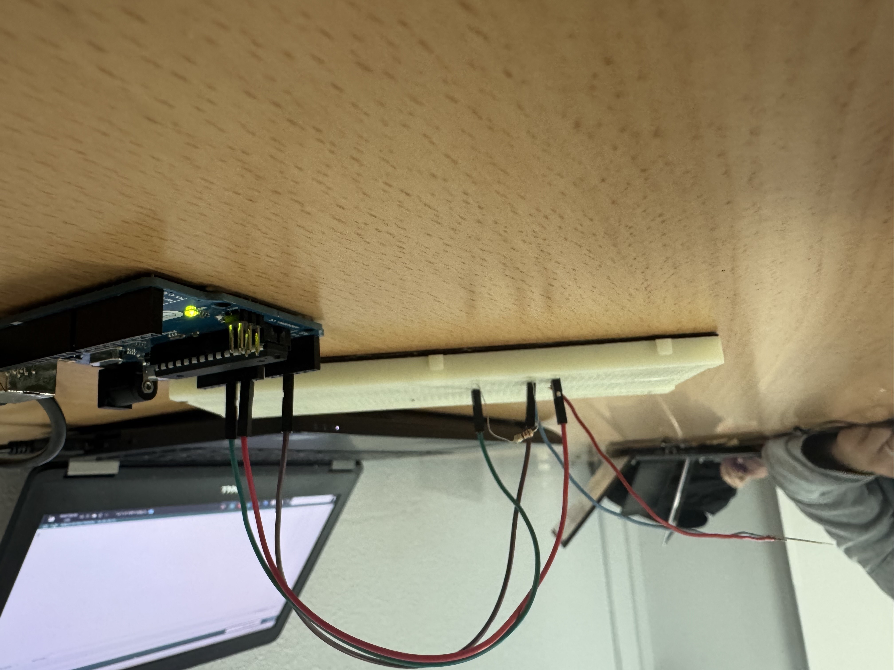 | 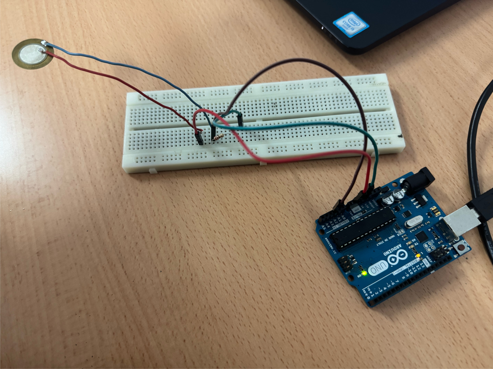 | 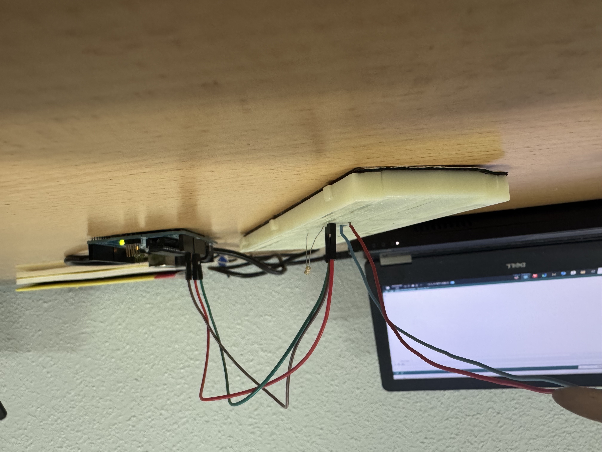 |

El objetivo de este circuito es que tenemos un sensor de presión, cuando no le hacemmos nada tiene un valor y cuando le pulsamos el valor cambia depende de la fuenza que le metemos al sensor.

## - Programación con sensor de presión.

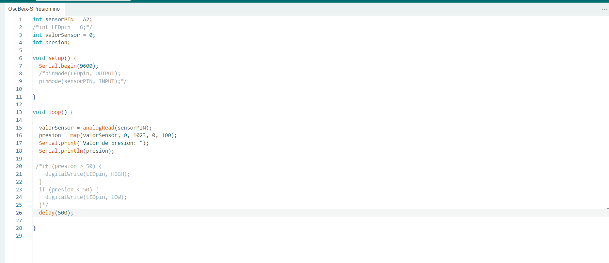

Este programa emmpieza con tres int (variables), uno es sensorPIN esta conectado al A2, otro que dice que ell valorsensor es 0 y otro que es solamente presión.

Después tenemos un void stup(inicio de programa en que solo fuciona una vez), dentro de el solo tenemos un Serial.begin(9600) (es la velocidad que traspasa que son 9600 baudios).

Después tenemos un void loop(crear un bucle), dentro tenemos valorsensor = analogRead(sensorPIN) ( significca que los valores de valorsensor es igual que la lectura analógica del sensorPIN), tenemos que presion = map(valorsensor, 0, 1023, 0, 100) (significa que la presion es igual quue el mapeo del valorSensor, que es de 0 a 1023 y el 0 y 100 es los valores que se marquen en el ordenador), después tenemos Serial.print("Valor de presión: ") (significa que en el monitor serie marcará como nombre de vallor de presión), después tenemos Serial.println(presion) (significa que el monitor serie coge valores de la presion) y al final tenemos un delay(500) (para que tenga un tiempo de pausa).

## - Video de funcionamiento con sensor de presión.

  

Este es el video del sensor de presión funcionando.

# Sensor de humedad.

## - Foto de montaje con sensor de humedad.

| Foto 1 | Foto 2 | Foto 3 |
| - | - | - |
| 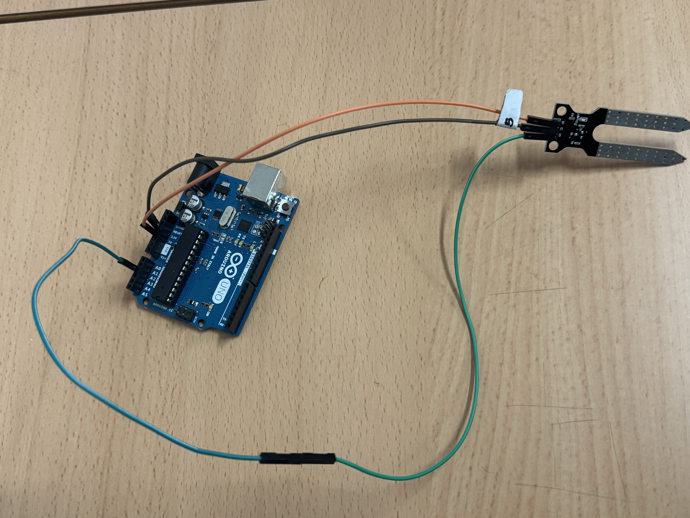 | 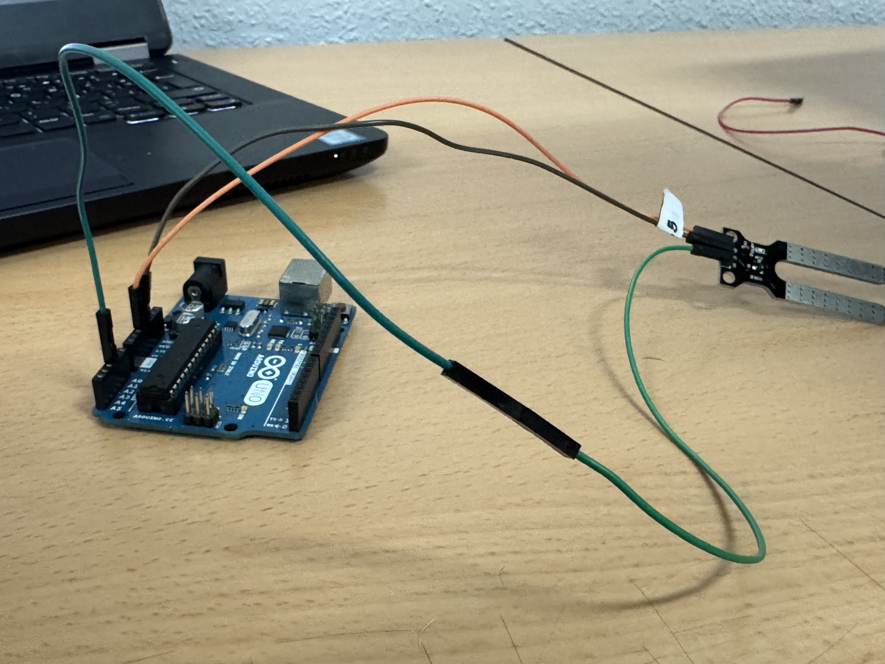 | 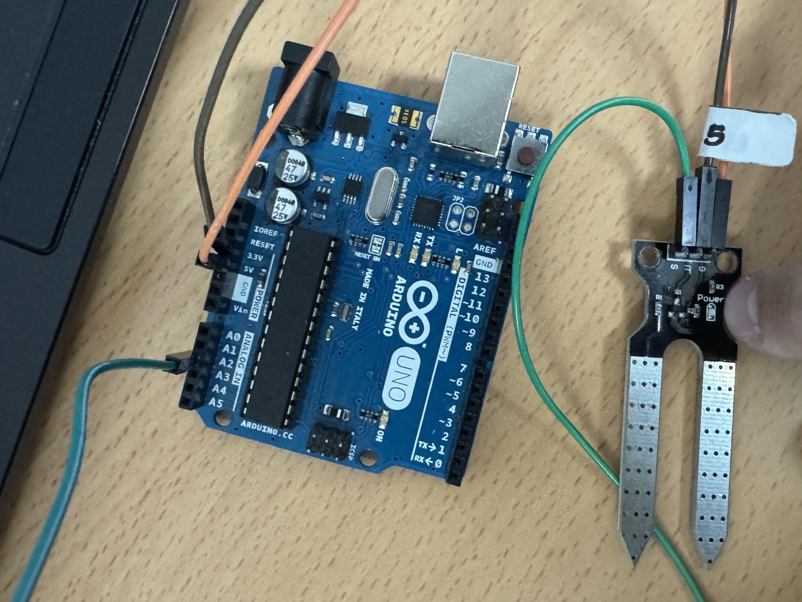 |

El objetivo de este circuito es que al cambiar de humedad de algo, el valor o sube o baja.

## - Programación con sensor de humedad.

Todos los programaciones que tenemos a continuación son iguales, sin embargo que no he incluido de que en el monitor serie marca letras explicativas, los sensores que utilizamos y los nombres de algunos variables son diferentes, en este caso usamos el sensor de humedad y que tiene el nombre de variable se llama humedad. También se hace el mapeo, se marca los datos en monitor serie y todos los demas son iguales.

## - Video de funcionamiento con sensor de humedad.

Este es el video del sensor de humedad funcionando.

# Sensor de LDR.

## - Foto de montaje con sensor de LDR.

| Foto 1 | Foto 2 | Foto 3 |
| - | - | - |
| 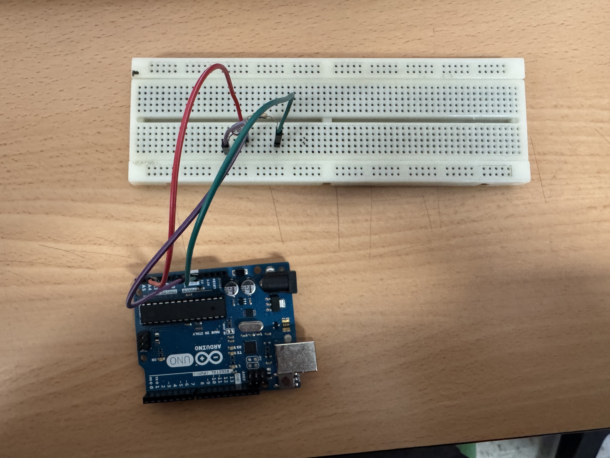 | 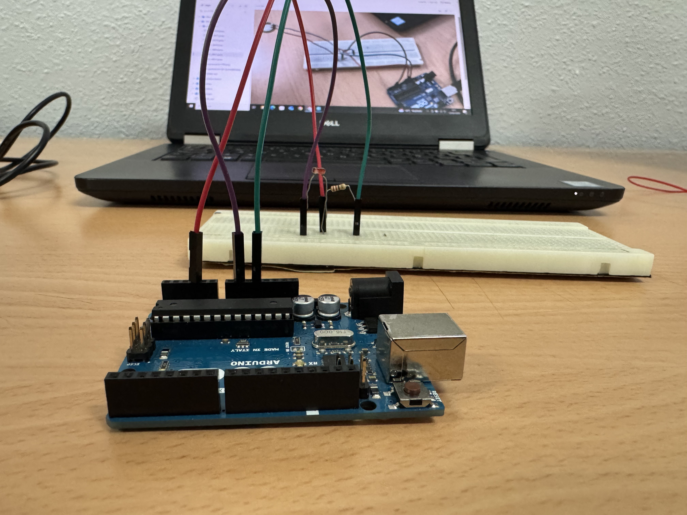 | 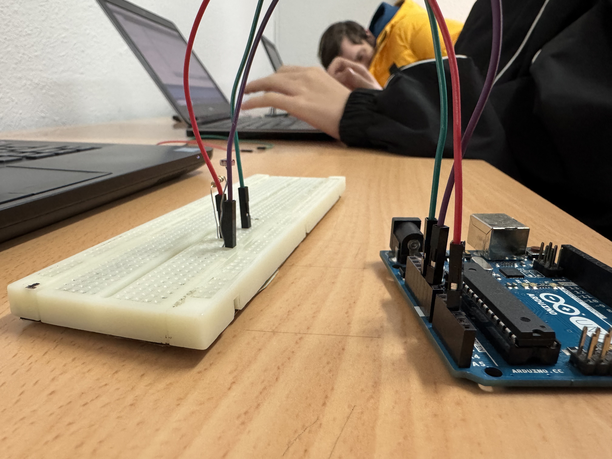 |

El objetivo de este circuito es que al cambiar la cantidad de luz la que detecta el valor sube o baja.

## - Programación con sensor de LDR.

En este caso usamos el sensor de LDR y el nombre de variable se llama cantidadluz, que sirve en cambiar la luminosidad y el valor va cambiando ,y se cambia entre 0-100, también se usa el mapeo, los datos se marca en monitor serie y todos los demás son iguales.

## - Video de funcionamiento con sensor de LDR.

Este es el video del sensor de LDR funcionando ( hemos usado el video del grupo de Adrián Carrillo y Iker Sucino porque nuestra placa no funcionaba ).

# Sensor de temperatura.

## - Foto de montaje con sensor de temperatura.

| Foto 1 | Foto 2 | Foto 3 |
| - | - | - |
| 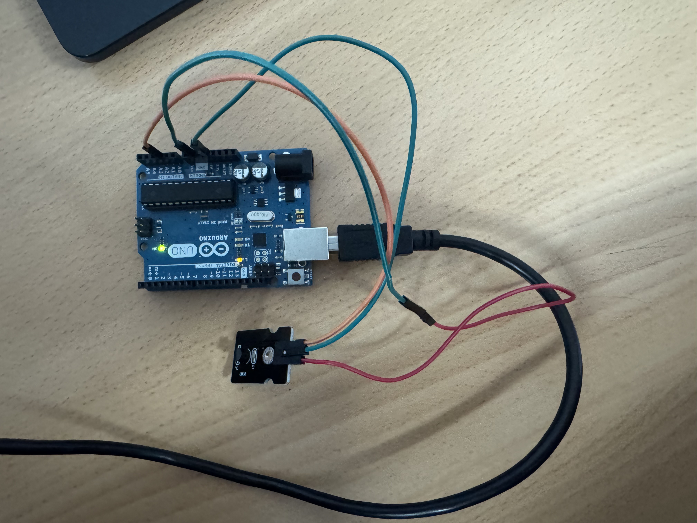 | 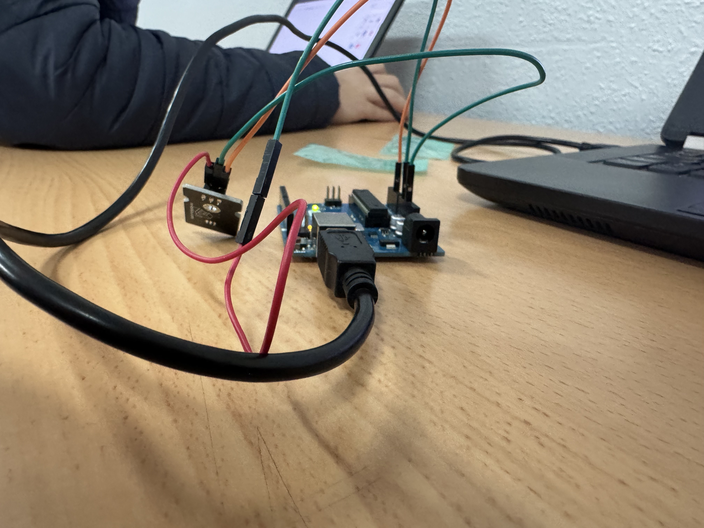 |  |

El objetivo de este circuito es que al cambiar la temperatura el valor sube o baja.

## - Programación con sensor de temperatura.

En este caso usamos el sensor de temperatura y de variable temperatura y grados, consiste en cambiar la temperatura que detecta en sensor y marcarlo en el monitor serie, en el video se puede ver, al acercar el mechero encendido, el valor que da en el monitor serie iba subiendo,y si lo apagamos el valor iba poco a poco bajando.

## - Video de funcionamiento con sensor de temperatura.

Este es el video del sensor de temperatura funcionando.

# Sensor de presión lineal.

## - Foto de montaje con sensor de presión lineal.

| Foto 1 | Foto 2 | Foto 3 |
| - | - | - |
| 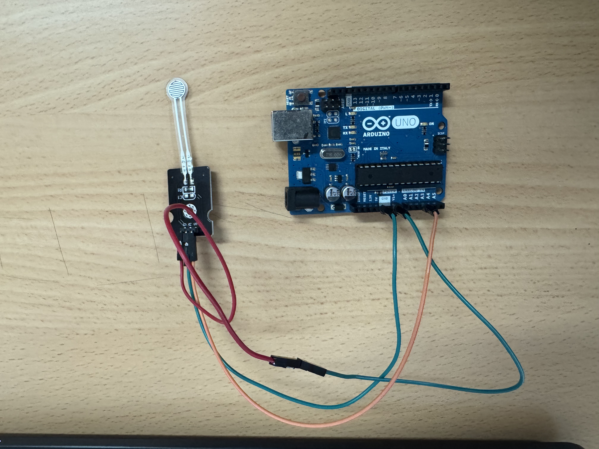 | 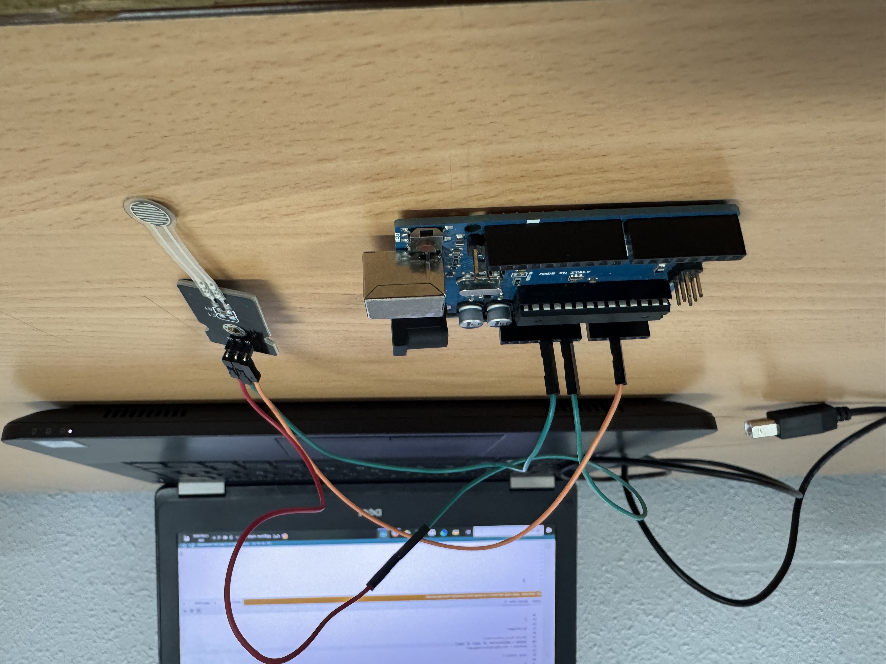 | 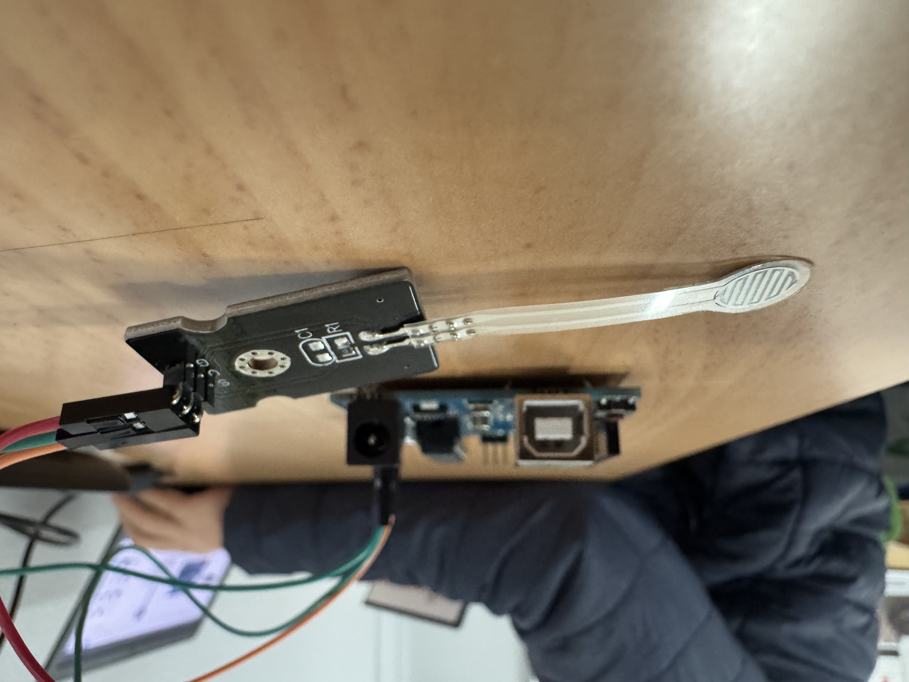 |

El objetivo de este circuito funciona en que al presionarlo el valor sube  baja depende de la fuerza que le metes. 

## - Programación con sensor de presión lineal.

 

En este caso usamos el sensor de presión lineal y de variable presión , todos los programaciones son iguales, es diferente al de presión normal en que es más largo que es lineal en vez de directo, pero también hace el mapeo, marca los datos en el monitor serie y todos los demás son iguales.

## - Video de funcionamiento con sensor de presión lineal.

Este es el video del sensor de presión lineal funcionando.

# Diseño de invernadero.

En este trabajo consiste en que nosotros hemos diseñado un invernadero 3D de tamaño de largo 4 vigas (16cm de largo) y ancho 3 vigas, también tiene pilares para que tenga superficie para que se sujete, el objetivo es montar un invernadero fácil y ligero para llevarlo a una competición de tecnología.

## - Vigas y pilares de invernadero.

Estos son diseños 3D de vigas y pilares, lo que hemos hecho es que cada uno en individual hace un diseño de vigas y pilares para que después puedan adjuntarse con los suelos y los lados. Todos los pilares están hechos por entrantes para que después se pueda conectar a los vigas, y las vigas unos están hechas de dos salientes y otros de un entrante y un saliente, para que se puedan conectar entre sí.

## - Suelo de invernadero.

| foto 1 | foto 2 |
| - | - |
|  |  | 

Estos dos son algunos suelos que estado diseñando yo, lo que hemos hecho es que cada uno del grupo hace una parte de suelo y son 12, los diseños tienen que ser todos iguales para que después al montarlo que se encaje, están dividido desde 1-4 y de A-C, el 3A es añadir una visera en el lado izquierdo y hacer dos entradas, uno por arriba y otro por el lado derecho para que después se pueda encajar con otros.

En el caso de 4B es igual pero tenemos que dar cuenta de una cosa, todos los largos de los suelos miden 15 cm pero todas las piezas 4 tiene largo 16 cm, eso es porque depende de lo largo de las vigas y el pilar los suelos quedarían muy adjuntados, por eso hemos decidido alargarlo 1 cm más para que no sea tan apretujado, y el 4B tiene dos viseras en que uno está en el lado izquierdo y el otro abajo, y un entrante que está arriba.

## - Foto del suelo entero.

Este es el diseño del suelo de invernadero entero en que se pueda ver que cada una de las piezas están conectadas entre sí y no fallan en ningún lado. Cada fila tiene asignada una letra y cada columna tiene unos números iguales. 

## - Foto de montaje real.

| Foto 1 | Foto 2 | Foto 3 |
| - | - | - |
| 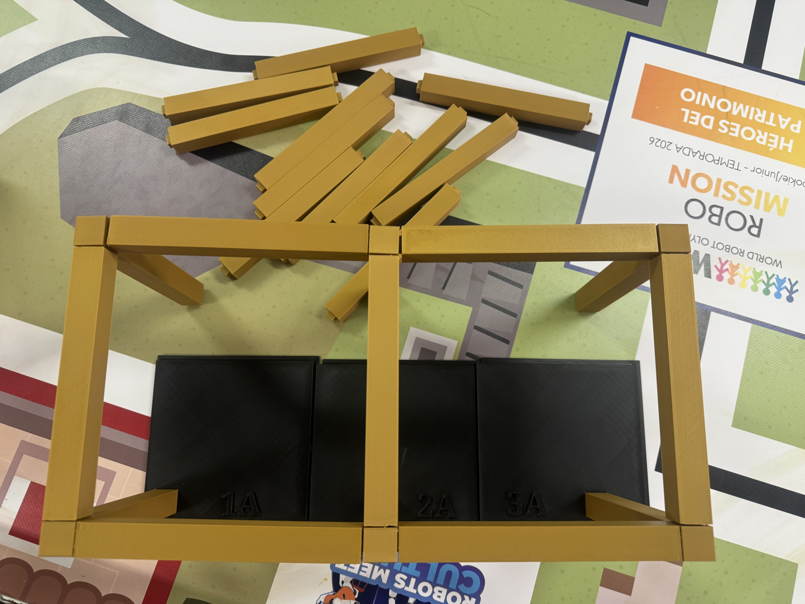 | 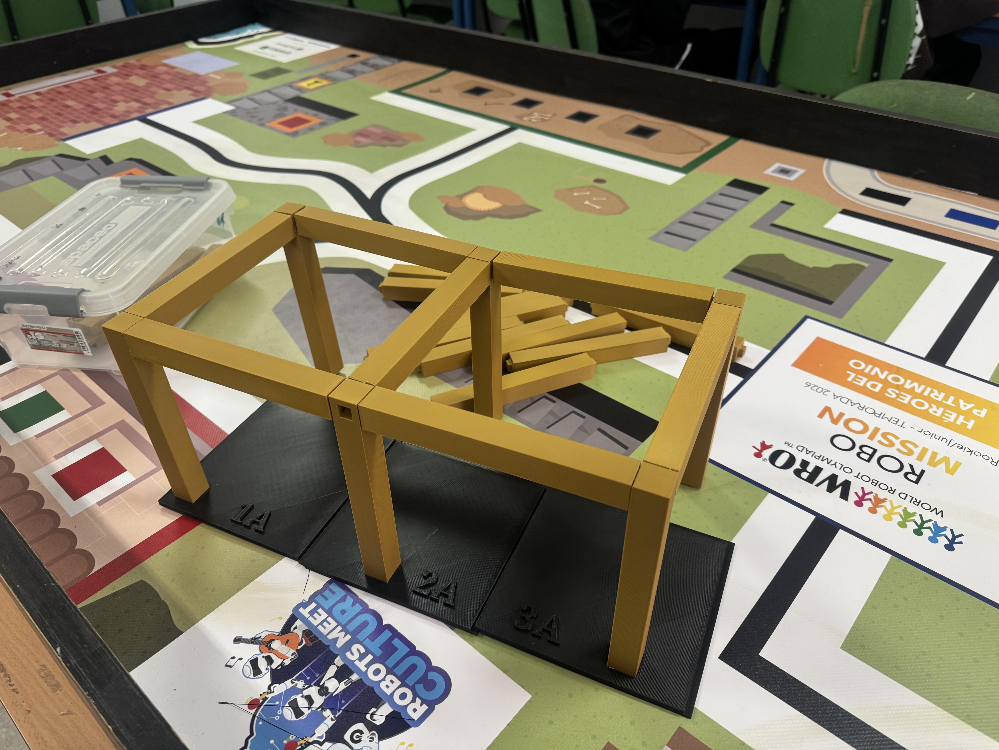 | 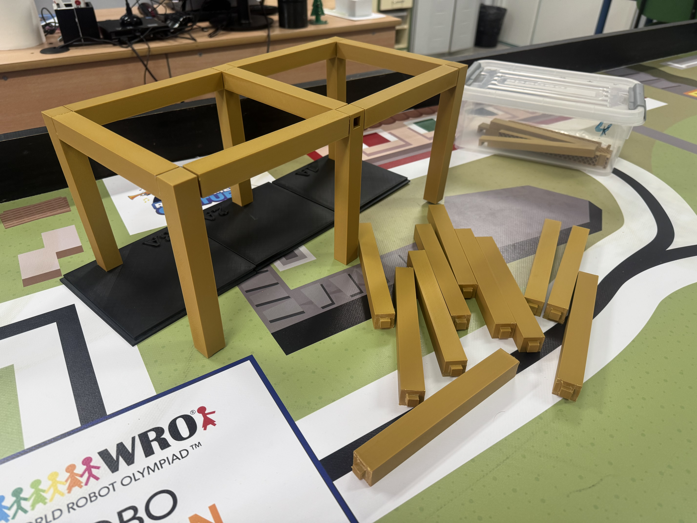 |

Este es el montaje final pero sin terminar, se puede ver en la foto los suelos están sobresalidos, eso después se alima, después los que no están conectados irían conectados juntos al diseño y es más grande.

## - Foto de impresora.

 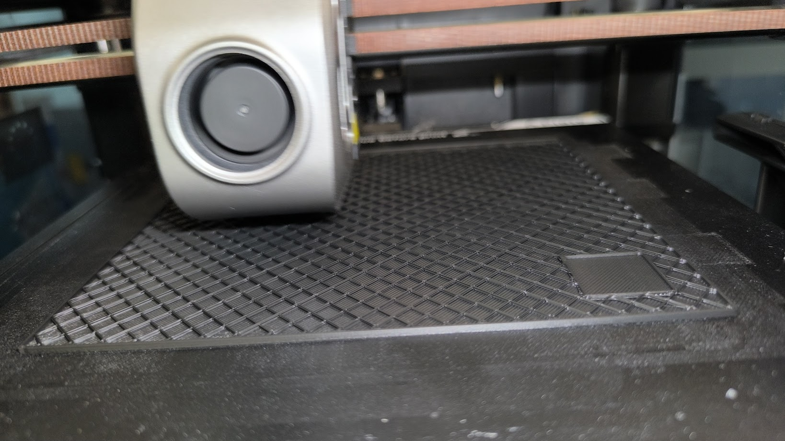 

Este es la impresora que nos hace las las vigas, el suelo y los pilares, se usa de material PLA para imprimir las cosas, la impresora es pequeña, por eso solo se puede imprimir piezas pequeñas para que después lo conectamos y juntamos todos.

## - Foto de invernadero entero vidareal.

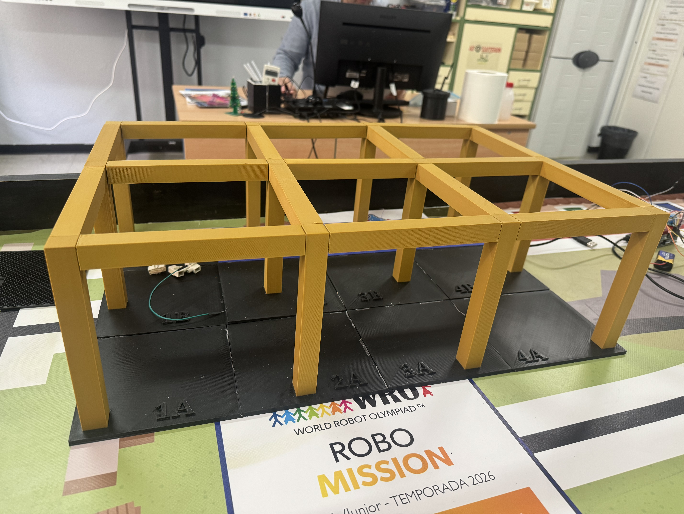

Este es el montaje final de invernadero, como podeis ver, estan unidas los suelos, las vigas y los pilares, los suelos estan unidos con cinta doble cara, y las vigas y los pilares tienen el tamaño justo de encajarlo.

# - Foto de programación final.

## - Maestro.

| Parte 1 | Parte 2 | Parte 3 | Parte 4 |
| - | - | - | - |
|  |  |  |  |

**_Parte 1:_** En la primera parte son de los variables,

**_Parte 2:_**

**_Parte 3:_**

**_Parte 4:_**

## - Exclavo.

## - Conexión de bluetooth.

