# Electrónica básica

Es el estudio de los circuitos y componentes que permiten modificar las característicasde la corriente eléctrica: la amplifican, permiten la circulación de electrones, eliminan ruidos, etc.

Se dividen en varios tipos de componentes: resistencias, condensadores, diodos, transistores, etc.

Los circuitos miniatuizados, se llaman circuitos integrados.

# Índice

- Resistencia fija/Variable.

- Condensadores.

- Diodos.

- Ledes. 

- Transitores.

- Relés.

# ¿ Qué hacen las resistencias?

Las resitencias dificultan el paso de la corriente, consiguiendo, así, variaciones de tensión en los puntos del cicuito donde sea necesario.

Hay dos resistencias significativas: fia y variable.

# Resistencia fija y variable.

# - Resistencia fija

## ¿Cómo funciona?

El valor de la resistencia fija está indicado mediante bandas que incuyen un código de colores, y se interpreta en siguientes formas:

- Las dos primeras bandas sustituye por el número al que equivale su color.

- Se pone tantos ceros como indique el color de la tercera banda.

- La última franja indica su tolerancia, si es dorada, la tolerancia es del 5%, y si es plata es del 10%.

## Símbolo electrónico.

## ¿Para qué sirve?

La resistencia fija sirve para para limitar la corriente y dividir el voltaje (como arriba explicado, cada color tiene una resistencia).

## ¿Cómo lo usamos en clase?

Lo usamos por ejemplo en tinkerkad en proyecto de robótica y también junto a potenciómetro en tecnología medor su voltios.

## Imagen del componente.

# - Resistencia variable

## ¿Cómo funciona?

Funciona en disponer tres contactos y tienen un valor total máximo entre sus extremos. El valor entre los extremos y el central puede variarse mediante el giro de una pieza interna.

## Símbolo electrónico.

## ¿Para qué sirve?

Sirven para controlar la intensidad de brillode una lámpara, la velicidad de giro de un motor o el volumen de un altavoz.

## ¿Cómo lo usamos en clase?

Lo hemos usado en cambiar los valores junto al diodoLED para cambiar la iluminosidad.

## Imagen del componente.

# Condensadores.

## ¿Cómo funciona?

La capacidad (C) de un condensador es la cantidad de carga que es capaz de almacenar por cada voltio aplicando en sus extremos. Se mide en faradios (F).

## Símbolo eléctrico.

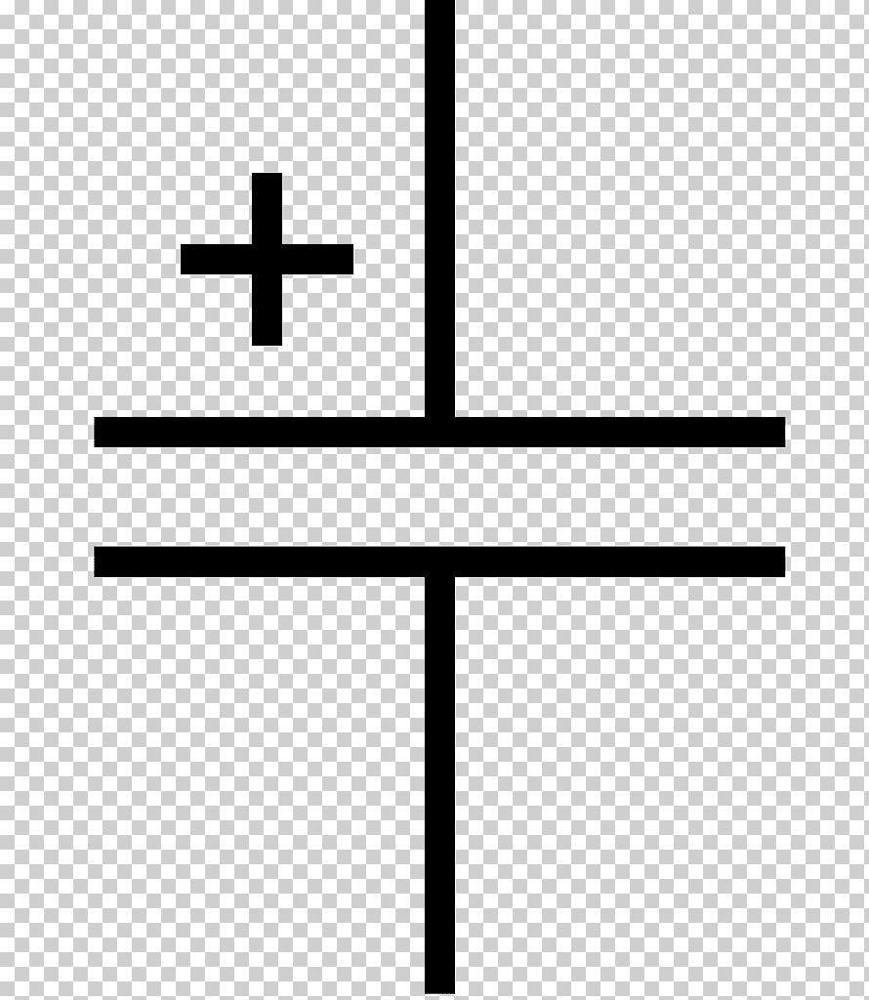

## ¿Para qué sirve?

Esta dividido en dos tipos: no polarizados y polarizados.
- No polarizados: se fabrican de papel, con material cerámico o de poiéster.
- Polarizados: pueden ser de aluminio o de titanio, poseen mayor capacidad que la otra y hayq ue conectarlo correctamente en el circuito.

Y los dos sirven en almacenar energía eléctrica mediante dos placas conductoras.

## ¿Cómo lo usamos en clase?

Hemos ido midiendolo con perímetros para saber si su magnitud si escorrecta o tiene diferencia.

## Imagen del componente.

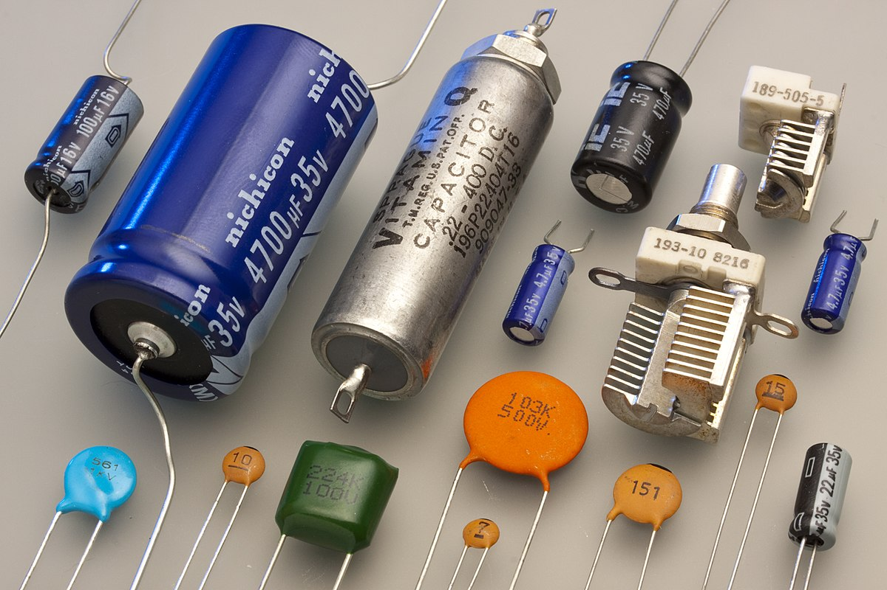

# Diodos.

## ¿Cómo funciona?

Funciona en permitir pasar los electrones en un sentido y no en el otrp gracias al material semiconductor con el que está fabricando.

## Símbolo eléctrico.

## ¿Para qué sirve?

Sirve para dirigir la corriente eléctrica en rectificadores(Aparato que transforma una corriente alterna en corriente continua) y en elementos de protección de circuitos.

## ¿Cómo lo usamos en clase?

En la clase lo hemos usado para proteger el relé.

## Imagen del componente.

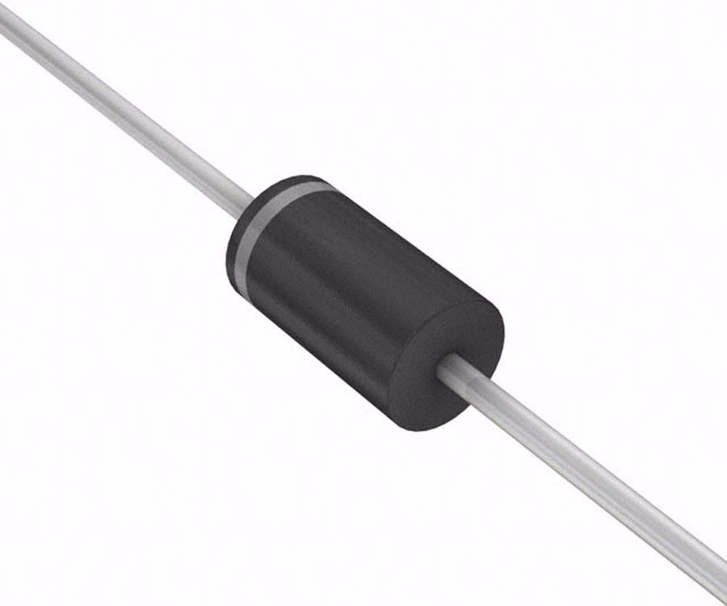

# Ledes.

## ¿Cómo funciona?

Es un tipo especial de diodo que es capaz de emitir luz cuando es atravesado por la corriente eléctrica.

## Símbolo eléctrico.

## ¿Para qué sirve?

Sirve para producir de manera eficiente, convirtiendo la energía eléctrica en luz a través de un semiconductor.

## ¿Cómo lo usamos en clase?

Lo hems usado en circuitos juntos a pulsadores para que brille.

## Imagen del componente.

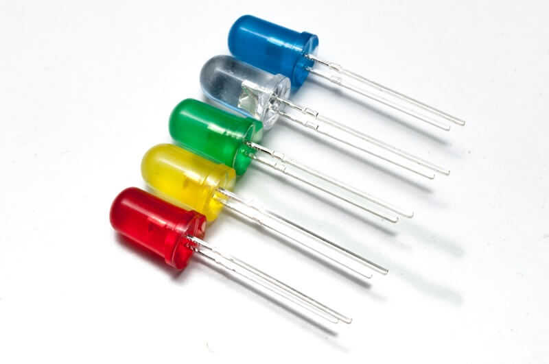

# Transitores.

## ¿Cómo funciona?

Funciona como un interruptor automático, que se activa con pequeña corriente de la base, y permite la circulación de dicha corriente entre el colector y el emisor.

## Símbolo eléctrico.

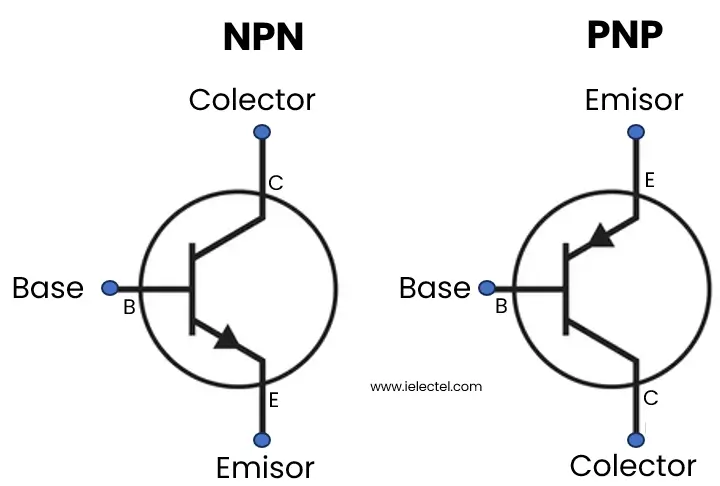

## ¿Para qué sirve?

Tiene tres estados posibles:

- Corte: no hay corriente en la base y los electrones no pasan del emisor al colector. Interruptor abierto.
- Saturación: A la base llega gran cantidad de electrones, y el paso entre colector y emisor se libera totalmente. Interruptor verrado.
- Amplificación: Si la corriente presente en la base se encuentra entre los valores de corte y saturación, el transistor entra en su zona activa y la corriente entre el colector y emisor será proporcional a la aue entra por la base. Y esto se denomina ganancia.

## ¿Cómo lo usamos en clase?

Lo estamos usando en tinkerkad y en físico para los circuitos.

## Imagen del componente.

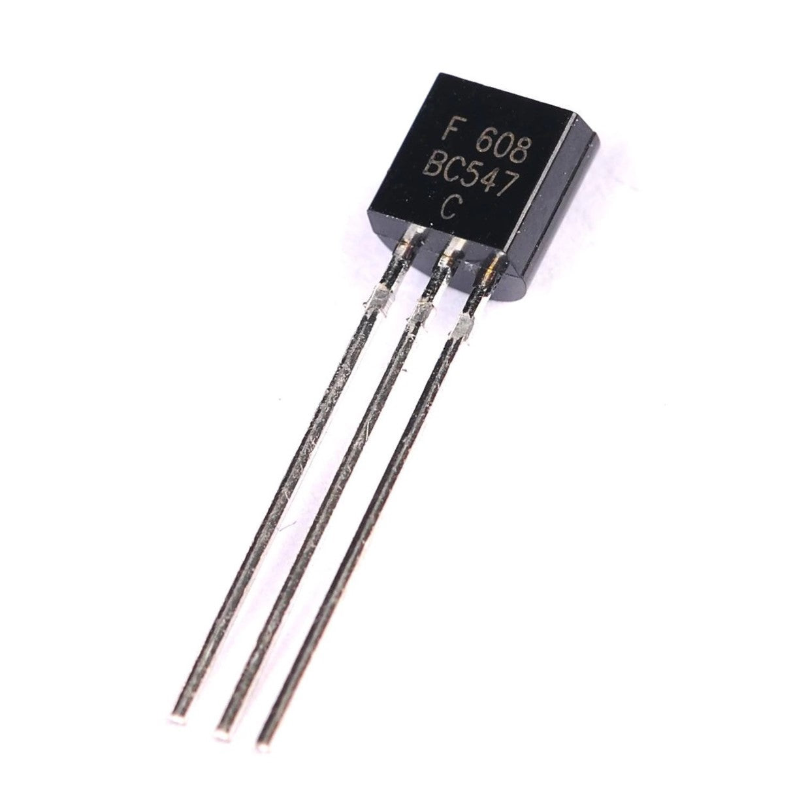

# Relés.

## ¿Cómo funciona?

Funciona como un interruptor controlado por electricidad, es decir, cuando la corriente eléctrica pasa por su bobina(bobina es un componente electrónico con dos terminales que almacena energía en un campo magnético y se usa en circuitos eléctricos), genera un campo magnético que atrae una armadura móvil. Esta armadura al moverse, cambia la posición, cerrando uno y abriendo otro.

## Símbolo eléctrico.

## ¿Para qué sirve?

Sirve para como interruptor eléctrico controlado que utiliza una señal de baja corriente para activar o desactivar otro circuito.

## ¿Cómo lo usamos en clase?

Lo estamos usando como elemento de separación de circuito para activar o desanctivar circuitos.

## Imagen del componente.

# Electrónica analógica.

## Circuitos:

## - Montajes básicos.

Este montaje de circuito tienemos una pila de 4,5 voltios (3 pilas de 1,5V), un LED, un pulsador, un transitor NPN, dos resistencia y un condensador poliradizado.

El objetivo de este circuito es que en principio el LED está apagado, pero al mantener el pulsador, la corriente eléctrica circula por la base, se activa el transitor y se enciende el LED, al mismo tiempo, el condensador se carga. Después al soltar el pulsador, el LED sigue iluminando pero se apaga poco a poco durante tiempo porque la corriente se corta y se queda sin carga.

## - Activación de un relé mediante un sensor.

En este montaje de circuito tenemos una pila de de 6 voltios, dos resistencias, un transitor NPN, un rele, un interruptor, un diodo y un LDR.

El objetivo de este circuito es que cuando incide luz sobre LDR, su resistencia disminuye y permite que circule corriente por la base de transitor, con lo que tanto este como relé se activan.

## - Relé para cambiar el sentido de giro de un motor.

En este montaje de circuito tenemos una pila de 6 voltios y otro de 9 voltios, un transitor NPN, un rele, un motor, una resistencia, un LDR, un potencíometro y un diodo.

El objetivo de este circuito es que cuando el circuito esta circulando e motor estará girando en un sentido, cuando la luz incide sobre LDR, la resistencia disminuye para que pase por la base de transitor y el diodo controla la cantidad que produce para apagar el relé y el motor girará hacia otro sentido.

# Electrónica digital.

## ¿Qué son las puertas lógicas?

Son componentes capaces de realizar operaciones sencillas con ceros y unos.

Las puertas lógicas más importantes son las denominadas: NOT, OR, AND, NOR, NAND y OR exclusiva.

## Puerta NOT (NO).

Es inversa, si entra un 1, sale un 0, y viceversa.

| a | S |
| - | - |
| 0 | 1 |
| 1 | 0 |

## Puerta AND (Y).

La salida es 1 cuando las dos entradas es 1, sino es 0.

| a | b | S |
| - | - | - |
| 0 | 0 | 0 |
| 0 | 1 | 0 |
| 1 | 0 | 0 |
| 1 | 1 | 1 |

## Puerta OR (O).

La salida es 1 cuando cualquiera de entrada sea uno, si los dos es 0 la salida es 0.

| a | b | S |
| - | - | - |
| 0 | 0 | 0 |
| 0 | 1 | 1 |
| 1 | 0 | 1 |
| 1 | 1 | 1 |

## Puerta XOR (O exclusiva).

La salida es 1 cuando uno de las dos entradas sean 1, si las dos dan 0 o dan 1 la salida es 0.

| a | b | S |
| - | - | - |
| 0 | 0 | 0 |
| 0 | 1 | 1 |
| 1 | 0 | 1 |
| 1 | 1 | 0 |

## Puerta NOR (O negada).

La salida es 1 cuando ninguna entrada tenga 1, si hay 1 en cualquiera da 0.

| a | b | S |
| - | - | - |
| 0 | 0 | 1 |
| 0 | 1 | 0 |
| 1 | 0 | 0 |
| 1 | 1 | 0 |

## Puerta NAND (Y negada).

La salida es 0 cuando las dos entradas son 1, si solo hay uno o ninguno es 1.

| a | b | S |
| - | - | - |
| 0 | 0 | 1 |
| 0 | 1 | 1 |
| 1 | 0 | 1 |
| 1 | 1 | 0 |

# Álgebra de Boole.

El diseño de los circuitos requiere encontrar las puertas adecuadas, simplificando al máximo la expresión obtenida en la tabla de verdad. A fin de hallar dicha expresión lógica y se recurre a esta álgebra.

## Entradas.

Entrada a. El estado de la puerta lo determinará un sensor de contacto que se cierra al abrir la puerta: puerta abierta 1, puerta cerrada = 0.

Entrada b. La luz será detectada por un sensor de luminosidad que mandará señales positivas cuando sea de día: día = 1, noche = 0.

Entrada c. La presencia de alguien en la habitación de al lado la indicará un sensor de movimiento: presencia = 1, ausencia = 0.

## Tabla de verdad.

| a | b | c | S |
| - | - | - | - |
| 0 | 0 | 0 | 0 |
| 0 | 0 | 1 | 0 |
| 0 | 1 | 0 | 0 |
| 0 | 1 | 1 | 0 |
| 1 | 0 | 0 | 1 |
| 1 | 0 | 1 | 0 |
| 1 | 1 | 0 | 1 |
| 1 | 1 | 1 | 1 |

## Expresión lógica.

S = ab'c' + abc' + abc

(') Este signo significa que esta negada. 

Si se intentase montar directamente esta expresión con puertas lógicas, se precisarían como mínimo dos puertas NOT, tres AND y un OR tripe, por lo que es necesario simplificarla.

## Álgebra de Boole.

S = ab'c' + abc' + abc =

= a(b'c' + bc' + bc) =

= a(b'c' + bc' + bc' + bc) =

= a((b' + b)c' + b(c' + c)) =

= a(1•c' + 1•b) =

= a(b + c')

# Montaje de circuito compuerta lógica.

## Foto de montaje.

| Foto1 | Foto2 | Foto3 |
| - | - | - |
| 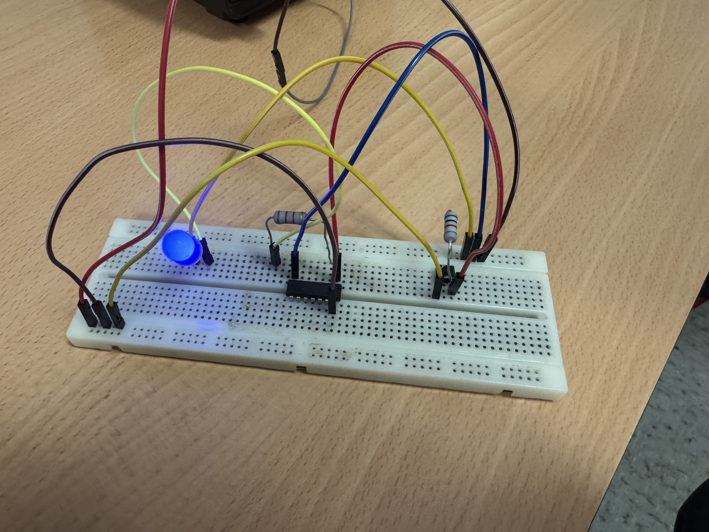 | 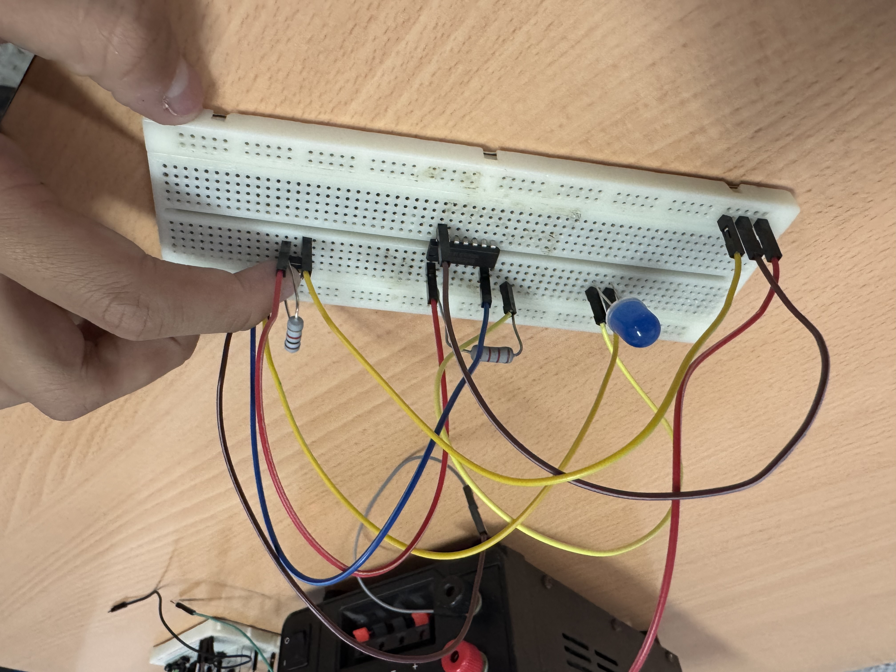 | 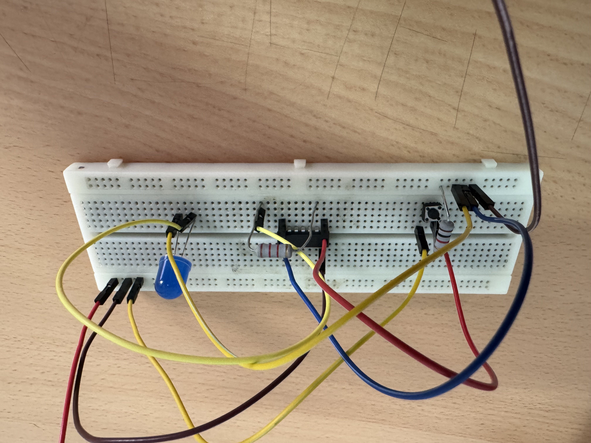 |

El objetivo de este circuito es que funcione con la puerta lógica, plusador y diodoled. Este circuito tiene una puerta NOT, funciona en, como podeis ver en la foto, esta siempre encendido, se apaga cuando mantienes al pulsador, funciona así porque un NOT si la entrada es 1, sale un 0 y viceversa. Es decir inicia el circuito, el diodo led está siempre encendido y si mantienes al pulsador se apaga y solo tiene una entrada y una salida.

## Foto de montaje en tinkerkad.

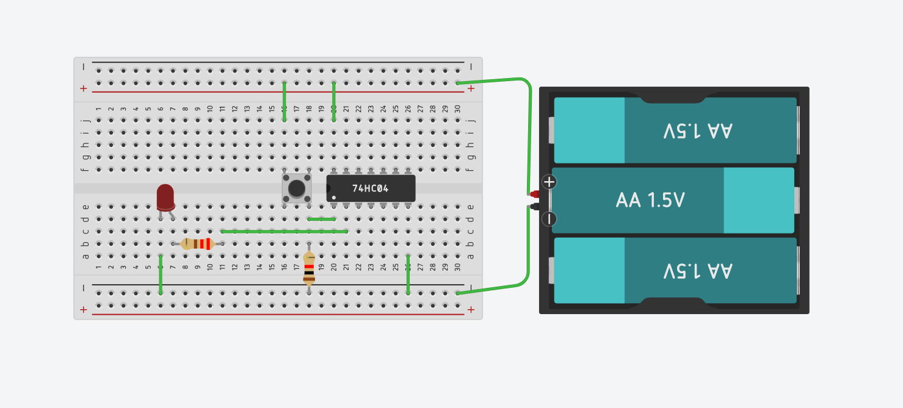

Este es el montaje de tinkerkad del circuito con puerta lógica NOT, esta brillando el diodoLED siempre, se apaga cuando le mantienes pulsado el pulsador y  si dejas de mantenerlo se enciende otra vez.

## - Disposición interna.

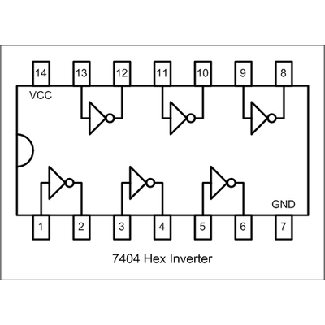

Este es una puerta lógica NOT, que tiene 7 en GND(tierra) y el 14 en 5V(voltios), estan conectado en forma de si el 1 es entrada, el 2 será salida; si el 3 es entrada, el 4 es salida, y asi constantemente hasta el 13 pero no incluyendo el 7 y el 14.

# Circuito de compuertas lógicas con relé.

# Circuito de compuertas lógicas con diodoLED.

Primero empezamos con una pila de 6 voltios que tiene un lado positivo y un lado negativo ( en el positivo y el negativo están conectados todos entre sí en dirección horizontal), después tiene un LDR que tiene un terminal conectado en positivo y el otro intermitente está conectado junto con una resistencia de 1000 ohmios y la resistencia está conectado en el negativo, y tiene otro cable conectado en la entrada de puerta 7404 (NOT), después la puerta 7404 tiene el terminal 14 (5V) conectado en el positivo

## Foto de montaje.

| Foto1 | Foto2 | Foto3 |
| - | - | - |
| 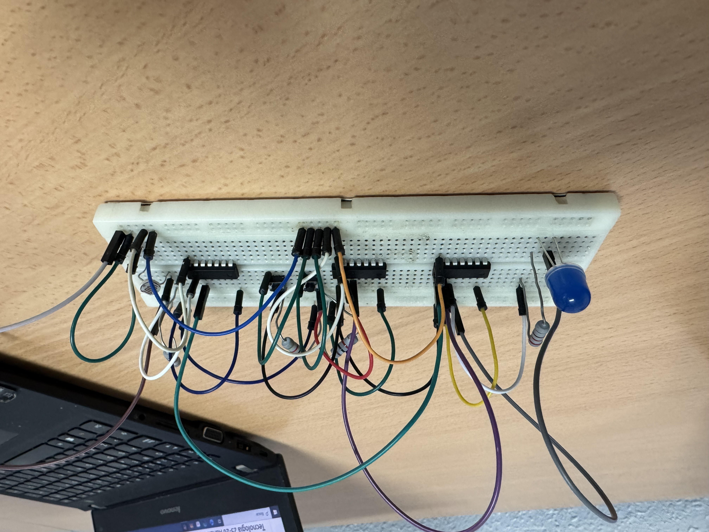 |  | 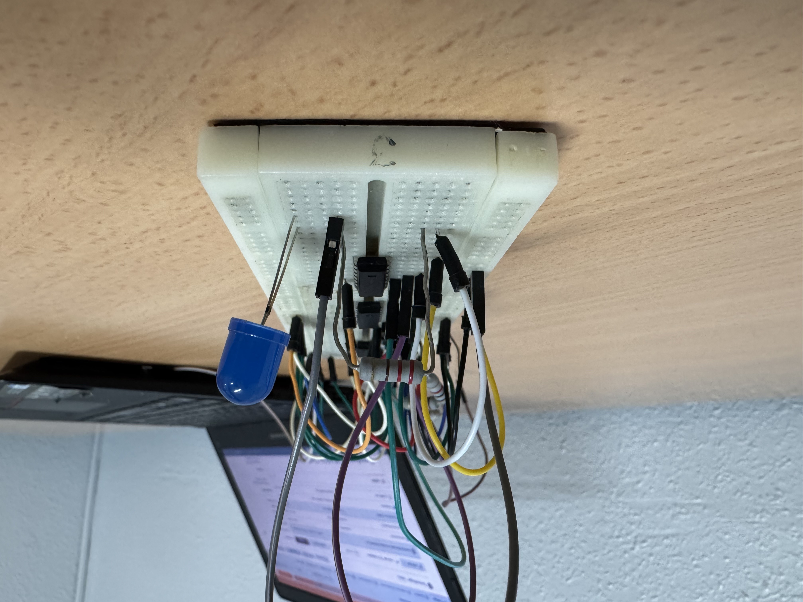 |

## Tabla de verdad y foto.

| a | b | c | S |
| - | - | - | - |
| 0 | 0 | 0 | 0 |
| 0 | 0 | 1 | 1 |
| 0 | 1 | 0 | 1 |
| 0 | 1 | 1 | 1 |
| 1 | 0 | 0 | 0 |
| 1 | 0 | 1 | 0 |
| 1 | 1 | 0 | 0 |
| 1 | 1 | 1 | 0 |

Esta tabla de verdad funciona en que el a esta pasando por un NOT, el b junto con el c pasan primero por OR, y por lo último los dos valores(valor que da en a al pasar por el NOT y el valor que da del b y el c al pasar en un OR) pasan por un AND y se sale.

## Disposiciones interna de puertas lógicas.

| 7404 (NOT) | 7408 (AND) | 7432 (OR) |
| - | - | - |
| 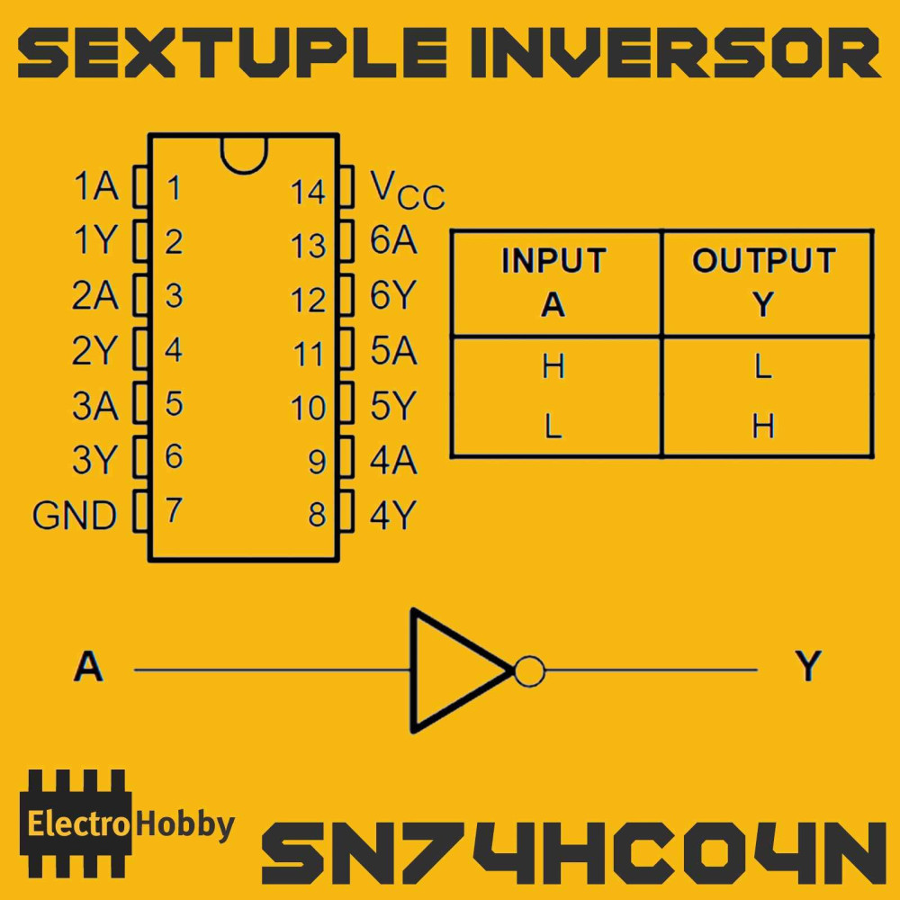 | 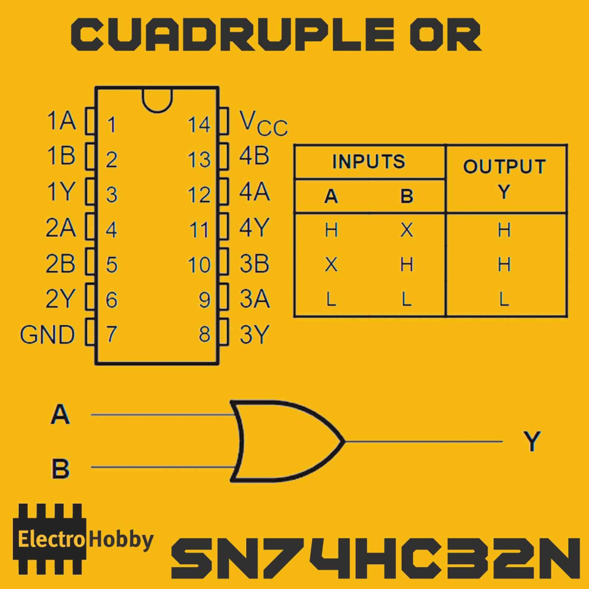 | 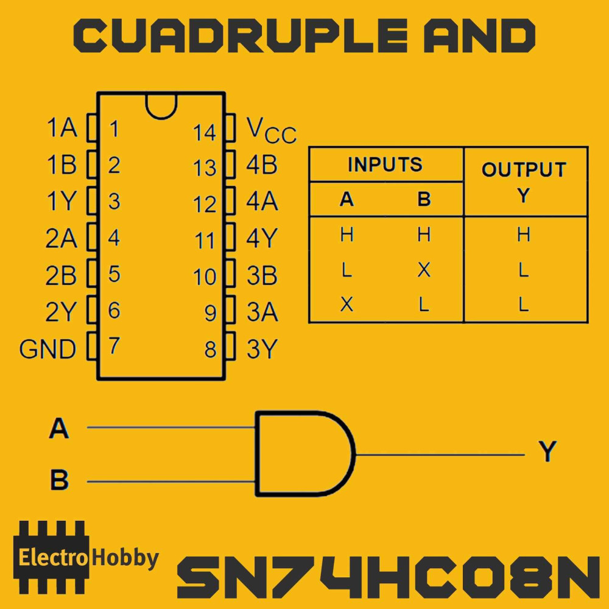 |
